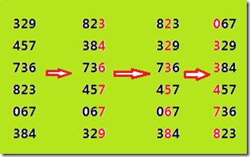

### 基数排序优化

#### 原理

基数排序就是先按照个位数字排序，然后按照十位数字排序，接着百位，千位，万位...，最终数组将变成有序数组。

#### 基数排序的分解

1. 提取某一位（k位）上的数字
    1. 除以10^(k-1)
    2. 对10取余
2. 按照提取的这一位上的数字进行计数排序

然后不断的循环上述过程，直到每一位的数字都被遍历。

#### 基的优化

假设数组范围为(0, 1000 * 1000)。
+ 以最基础的10为基，那么上述的循环就要进行6次;
+ 以100为基，那么上述循环只进行3次就可以，而唯一的改变就是在每一次的计数排序过程中，用于计数的数组空间由O(10)变为了O(100);
+ 以1000为基，那么上述循环只需进行2次就可以，这次在每一次的计数排序过程中，用于计数的数组空间由O(10)变为了O(1000);

因此，通过增加基的大小可以显著改善效率。

#### 除法和取余优化

在C和C++中，除法和取余的效率是非常低的，而在基数排序中要反复用到求某一位的数字，最常规的方法就是除法和取余，因此在本算法中需要尽量避免。我们很自然的想到用移位和与操作来取代除法和取余。当然，可以这样操作主要还是因为基数的选取比较自由。

在十进制中可以以10，100，1000为基数，当然也可以在二进制中以8，16，32，64，128，256，512，1024为基数。这样在某一位上的数组就可以用移位和与来操作。

例如：0x5d4f32 = 6115122，以16为基：

    从右第一位 = 0x5d4f32 & 0x0F = 2;
    从右第二位 = (0x5d4f32 >> 4) & 0x0F = 3
    ...
    从右第六位 = (0x5d4f32 >> 20) & 0x0F = 5
    
    
当然，如果数据范围较大，也可以以256为基，再看0x5d4f32：

    从右第一位 = 0x5d4f32 & 0xFF = 32;
    从右第二位 = (0x5d4f32 >> 8) & 0xFF = 4f
    从右第三位 = (0x5d4f32 >> 16) & 0xFF = 5d
    
如此，就可以有效的避免除法和取余操作，效率也将大大提高。

#### 占用空间优化

网上代码的普遍做法是：分配空间的大小与数据的位数成正比，如下述代码：

    int *bucket = (int *) malloc((end-begin+1) * sizeof(int)); 
    
其中end就是最高位，begin为最低位，如果数据范围为(0, 1000 * 1000)。那么上面分配的空间将是6个原始数组大小的空间，实际上只需一个或两个即可。

#### 加速效果

当数组大小 N = 50000000，数据的最大值为 K = 0x7FFFFFFF 时。

串行时间： 3.103s

并行时间： 0.66s

加速比： 4.70倍

当数组大小 N = 80000000，数据的最大值为 K = 0x7FFFFFFF 时。

串行时间： 5.034s

并行时间： 1.053

加速比： 4.78倍

#### 总结

综上，为了有效改善基数排序的效率，用2的n次幂做基数是较好的选择，大的基数，并避免除法和取余操作。

当然，大的基数意味着大的空间占用，但是，如果数据量较大，这个占用相对来说还是很小的。

另外，要考虑数据的范围，如果数据范围是(0, 0xFFFFFFFF)，那么，把0xFFFF作为基数，只需两次循环，在计数排序中开辟空间的大小就为O(0xFFFF)；如果以0xFFF作为基数，则需三次循环，计数排序中开辟空间的范围也就减小。

也可参考[基数排序优化](http://blog.csdn.net/yutianzuijin/article/details/22876017)
