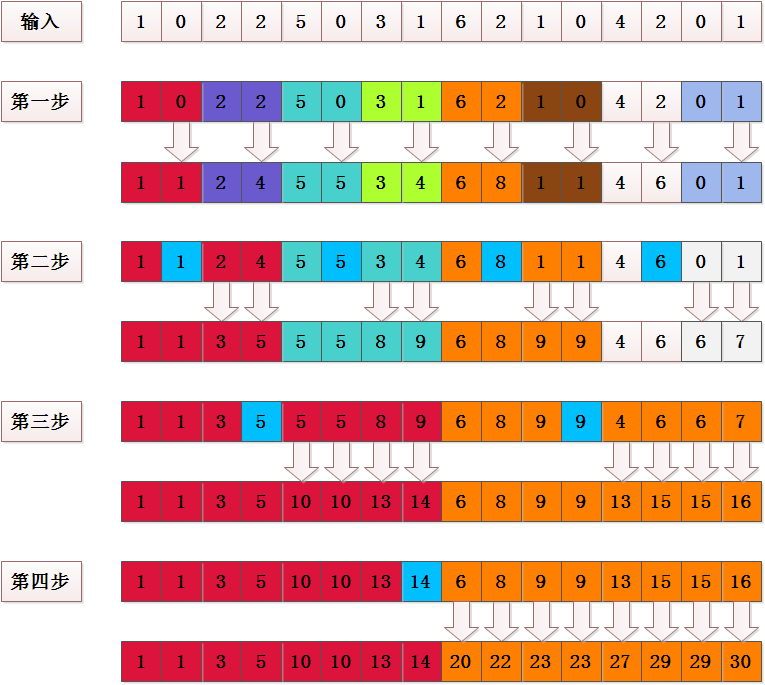

### 计数排序及并行实现

#### 计数排序定义及思想

假设 n 个输入元素中的每一个都是介于 0 到 k 之间的整数，此时k为某个整数，在可以采用计数排序，计算复杂度为 O(n)。

计数排序的基本思想是对每一个输入元素 x ，确定出小于 x 的元素个数。有了这一信息，就可以把 x 直接放到它在最终输出数组的位置上。

#### 计数排序流程

1. 统计输入数组 A 中元素 i 的个数，存于 C[i] 中。因为 A 中元素大小为 0 到 k，所以C的大小为 (k+1)。
2. 对数组 C 进行累积和，此时 C[i] 表示小于等于元素 i 的个数。
3. 从最后到最前开始遍历输入数组 A，知道 A[i] 在最终数组B的位置之前的元素个数 C[A[[i]]]，所以 B[C[A[i]]] = A[i]


#### 串行计数排序伪代码

```cpp
    COUNTING-SORT（A, B, k）
    for i <- 0 to k
         do C[i] <- 0
    for i <- 0 to length(A)
         do C[A[i]] <- C[A[i]] +1
    for i <- 1 to k
         do C[i] <- C[i] + C[i-1]
    for i <- length(A) downto 1
         do B[C[A[i]]] <- A[i]
             C[A[i]] <- C[A[i]] -1        
```

#### 计数排序并行优化

+ 第一步优化

统计输入数组 A 中元素 i 的个数，与统计图像的直方图完全类似，只不过数据范围不是 0-255，而是 0-k。因此可以借用统计图像直方图的并行思路。

```cpp
    __global__ void CountingSortKernelOne(int *A, int *C, int iSize)
    {
        int x_id = blockDim.x * blockIdx.x + threadIdx.x; // 列坐标

        if (x_id < iSize)
        {
            int iIdx = A[x_id];
            atomicAdd(&C[iIdx], 1);
        }
    }
```

> 注意，由于此时可能有多个线程同时在 C[i] 上进行加法，所以要使用原子加法。

+ 第二步优化

对数组 C 进行累积和与数组就和类似，但又有所不同。

例如：

输入：A = [1, 2, 3, 4, 5]

求和：15

累积和：[1, 3, 6, 10, 15]

考虑到数组求和可以使用规约算法，此处在数组求和的规约算法上进行改进。如下图所示：




如此，经过 lg2(n) 次就可以完成累积求和。

> 注意，由于当前进程可能使用到其他进程的数据，所以要注意同步问题。

```cpp
    __global__ void CountingSortKernelTwo(int *C, int k, int iSize)
    {
        // 坐标索引
        int x_id = blockDim.x * blockIdx.x + threadIdx.x; // 列坐标

        x_id++;

        if (x_id <= k)
        {
            int iRe = x_id & (iSize - 1);
            if (0 == iRe)
                iRe = iSize;

            if (iRe > (iSize >> 1))
            {
                x_id--;
                C[x_id] = C[x_id] + C[x_id + (iSize >> 1) - iRe];
            }
        }
    }

    void CountingSortTwo(dim3 dimGridK, dim3 dimBlockK, int *devC, int k)
    {
        int iSize = 1;
        while (iSize <= k)
        {
            iSize = iSize << 1;
            CountingSortKernelTwo<<<dimGridK, dimBlockK>>>(devC, k, iSize);
        }
    }
```

+ 第三步优化

由于 C[i] 包含小于等于 i 的元素个数，所以 C[i-1] 包含小于等于 i-1 的元素个数，C[i+1] 包含小于等于 i+1 的元素个数，因此，可以确定等于 i 的元素在最终数组 B 中的范围。

可得：`元素 i 在 B 中的范围为：A[i-1] 到 A[i] - 1`。

例如：上图，

元素 0 的范围为 ：0 到 B[0] - 1  

元素 1 的范围为 ：B[0] 到 B[1] - 1

元素 2 的范围为 ：B[1] 到 B[2] - 1

...

元素 15 的范围为 ：B[14] 到 B[15] - 1

由此可得最终的输出为：

0 1 2 3 4 5 6 7 8 9 10 11 12 13 14 15 16 17 18 19 20 21 22 23 24 25 26 27 28 29

0 2 2 3 3 4 4 4 4 4 6  6  6  7  8  8  8  8  8  8  9  9  10 12 12 12 12 13 13 15

```cpp
    __global__ void CountingSortKernelThree(int *B, int *C, int k)
    {
        int x_id = blockDim.x * blockIdx.x + threadIdx.x; // 列坐标

        if (x_id <= k)
        {
            int iStart = 0;
            if (0 != x_id)
                iStart = C[x_id - 1];

            for (int i = iStart; i < C[x_id]; i++)
                B[i] = x_id;
        }
    }
```

#### 加速结果

当数组大小 N = 20000000，数据的最大值为 K = 10000000 时。

串行时间： 1.731s

并行时间： 0.177s

加速比： 9.78倍


当数组大小 N = 50000000，数据的最大值为 K = 10000000 时。

串行时间： 4.31s

并行时间： 0.241s

加速比： 17.88倍


当数组大小 N = 50000000，数据的最大值为 K = 10000000 时。

串行时间： 6.922s

并行时间： 0.327s

加速比： 21.17倍


当数组比较小时，并行时间反而会比较长，这是因为在 CPU 和 GPU 之间的传输消耗了大量时间，随着数据量的逐渐增大，加速比也会越来越明显。
