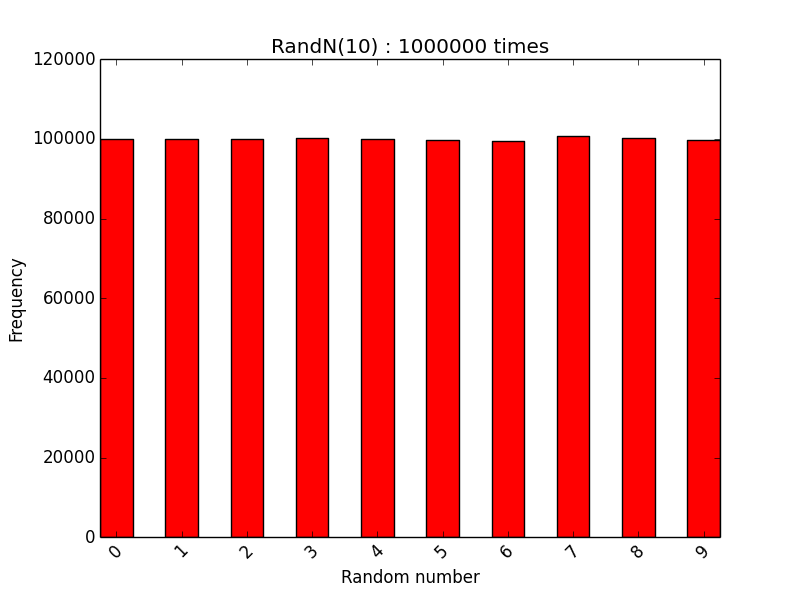
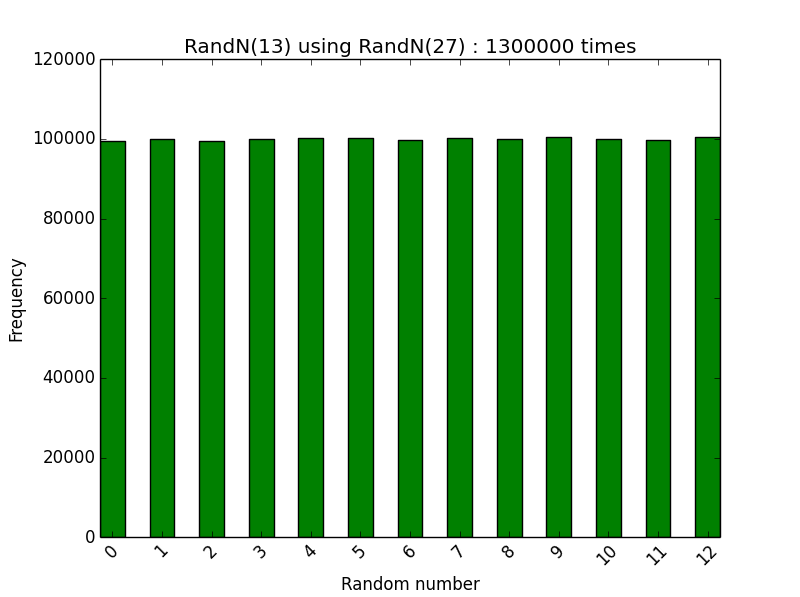
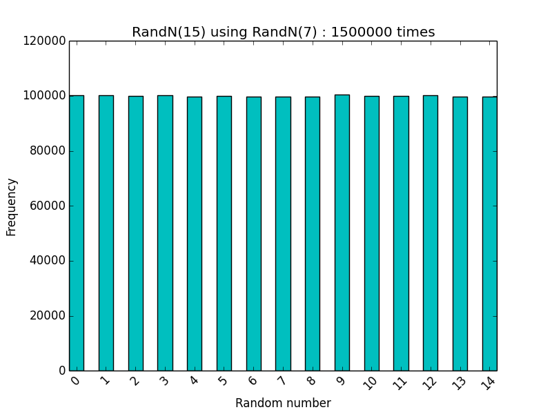

### 题目

已知一个能产生 [0, n) 的随机数的函数，设计一个能产生 [0, m)的随机数的函数。

> 要产生 [0, m) 的随机数，首先要确保输出 0、1、2、...、m-1 的概率相同。

### 验证函数 RandN

其中，RandN 表示能产生 [0, n) 的随机数的函数，如下所示：

```cpp
unsigned int RandN(unsigned int N)
{
    return 0 == N ? 0 : rand() % N;
}
```

此处令 N = 10，进行 1 000 000 次重复实验，统计 0，1，2，3，4，5，6，7，8，9出现的频度。如下图所示：



 0，1，2，3，4，5，6，7，8，9出现的频度近似相等，可以理解为等概率分布。

### 设计函数 RandM（M <= N）

如果 M = N 很简单，就是同一个函数；

如果 M < N，可以考虑使用截断的方式，因为 RandN 产生的 [0, 1, 2, 3, ..., N-1] 是等概率的，随机的，因此 [0, 1, 2, 3, ..., M-1] 也就等概率的，所以最简单的方式就是：如果 RandN() 输出小于 M，则直接作为 RandM() 的输出，否则继续生成，直到小于 M。

上述方法又一个欠缺，如果 N 较大，比如 N =1000，M较小，M = 10，那么从统计的角度考虑，要执行 100 次 RandN() 才能成功输出一个 RandM()，也就是所成功的概率是：$\frac{M}{N}$，效率太低。

针对上述方案的解决方案如下：

取一个整数 K，令 $ K  \le  N $，并且满足 $K = a * M \le N \le (a+1)*M = K + M$，把 K 作为结尾阈值，然后的到的结果对 K 取余即可。例如：令 N = 27，M=13，K =26，如果直接把 M 作为截尾阈值，则成功的概率为 $\frac{13}{27}$；如果把 K 作为截尾阈值，则成功的概率为 $\frac{26}{27}$

代码如下：
```cpp
unsigned int RandmUsingRandn(unsigned int M, unsigned int N, unsigned int(*func)(unsigned int))
{
    if (0 == M || 0 == N)
    {
        return 0;
    }

    if (M <= N)
    {
        // 取小于 N 的 M 的最大倍数，提高效率
        int iNDivM = N / M;
        int iTimesM = iNDivM * M;

        int iRandN = func(N); // 截尾能保证前面的概率依然相同
        while (iRandN >= iTimesM)
        {
            iRandN = func(N);
        }
        return iRandN % M;
    }
}
```

例如：令 N = 27，M=13，K =26，把 K 作为截尾阈值，进行 1 300 000 次重复实验，统计 0，1，2，3，4，5，6，7，8，9，10，11，12 出现的频度。如下图所示：



 0，1，2，3，4，5，6，7，8，9，10，11，12 出现的频度近似相等，可以理解为等概率分布。

### 设计函数 RandM（M > N）

由于 M  > N，所以不能使用简单的截断方法了，但是如果能产生一个大于 M 的随机数，那么就可以借用上述 M < N的情况。很幸运的是，有 RandN(N) 可以很方便的设计 RandN2(N*N)。

令 $N_1 = RandN(N)$ ，则：
$$
N_1 = [0, 1, 2, 3, ..., (N-1)]，其中每个数出现的概率都为：\frac{1}{N}
$$

令 $N_2 = RandN(N) * N$，则：
$$
N_2 = [0, N, 2N, 3N, ..., N*(N-1)]，其中每个数出现的概率都为：\frac{1}{N}
$$

则，$N_3 = N_1 + N_2$ 可表示为：
$$
N_3 =\left[ {\begin{array}{*{20}{c}}
0&1&{...}&{N - 1}\\
N&{N + 1}&{...}&{2N - 1}\\
{...}&{}&{}&{}\\
{N(N - 1)}&{N(N - 1) + 1}&{...}&{{N^2} - 1}
\end{array}} \right]\\
其中每个数出现的概率都为：\frac{1}{N^2}
$$

上述式子的含义就是任意从 N1中取一个数，任意从 N2 中取一个数，他们的和不会有重复，正好等于$[0, 1, 2, ..., N^2-1]$中的一个，并且出现每个数的概率为：$\frac{1}{N^2}$

所以下面的函数就可以很简单的生成一个 [0, N*N)之间的随机数：

```cpp
int iRandN2 = RandN(N) * N + RandN(N);
``` 

此时，就可以借用 M < N 的情况，有如下代码：

```cpp
unsigned int RandmUsingRandn(unsigned int M, unsigned int N, unsigned int(*func)(unsigned int))
{
    if (0 == M || 0 == N)
    {
        return 0;
    }

    if (M > N)
    {
        // 取小于 N^2 的 M 的最大倍数，提高效率
        int iN2DivM = N * N / M;
        int iTimesM = iN2DivM * M;

        // 有 Rand(N * N) = Rand(N) * N + Rand(N)
        // 同理可以推出 Rand(N^3), Rand(N^4)
        int iRandN2 = func(N) * N + func(N); // 截尾能保证前面的概率依然相同
        while (iRandN2 >= iTimesM)
        {
            iRandN2 = func(N) * N + func(N);
        }

        return iRandN2 % M;
    }
}
```

例如：令 N = 7，M=15，K = 45，把 K = 45 作为截尾阈值，进行 1 500 000 次重复实验，统计 0，1，2，3，4，5，6，7，8，9，10，11，12，13，14 出现的频度。如下图所示：



 0，1，2，3，4，5，6，7，8，9，10，11，12，13，14  出现的频度近似相等，可以理解为等概率分布。

> 注意：上述部份仍然有问题，因为我们人为假设 $N^2  \ge M$，如果 $N^2  \le M$呢，此时就需要产生更大的随机数了。

由 RandN(N) 可以很简单的推出 RandN2(N\*N)，同样，也可以推出 RandN3(N\*N\*N)等等。

令 $N_1 = RandN(N)$ ，则：
$$
N_1 = [0, 1, 2, 3, ..., (N-1)]，其中每个数出现的概率都为：\frac{1}{N}
$$

令 $N_2 = RandN(N) * N$，则：
$$
N_2 = [0, N, 2N, 3N, ..., N*(N-1)]，其中每个数出现的概率都为：\frac{1}{N}
$$

令$ N_3 = RandN(N) * N * N$，则：
$$
N_3 = [0, N^2, 2N^2, 3N^2, ..., N^2*(N-1)]，其中每个数出现的概率都为：\frac{1}{N}
$$

令 $N_4 = N_3 + N_2 + N_1$，则
$$
N_4 = [0, 1, 2, 3, ..., N^3-1]，其中每个数出现的概率都为：\frac{1}{N^3}
$$

上述推导其实可以看成一个N进制的数字：
1. $N_1$表示最低位，其中$N_1 = 0, 1, 2, N-1$；
2. $N_2$表示次低位，其中$N_2 = 0, N, 2N, N*(N-1)$；
3. $N_3$表示次次位，其中$N_3 = 0, N^2, 2N^2, N^2*(N-1)$；

所以$N_4 = N_3 + N_2 + N_1 = 0, 1, 2, ..., N^3 - 1$ 

根据上述规律，完全可以由 RandN() 来产生 [0, n)，[0, n^2)， [0, n^3)， [0, n^4)， [0, n^5)，。。。

> 从上面的分析似乎我们总可以找到一个能产生大于 M 的随机数，然而，我们没有考虑另外一种情况，如果M 和 N 都较大时，N^2或者N^3就有可能超过整数的范围现在，此时，可能需要需要使用 `unsigned long long int`作为中间变量了。


